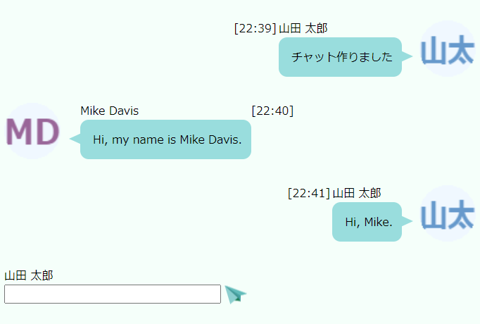
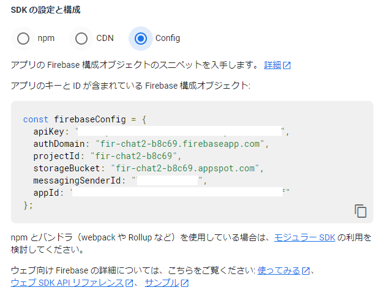
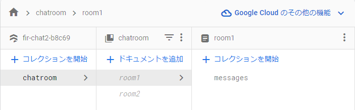

# LINE風リアルタイムチャット(React18 + FirebaseSDK V9)

[リアルタイムなLine風チャットアプリ](https://qiita.com/murasuke/items/72942bbfde858fe6879b)のReactとFirebaseを最新にしました

* React18 + FirebaseSDK V9 + ReactRouter6
* [名前からアイコンを作成](https://qiita.com/murasuke/items/b2113d6778834b04cf49)して表示する機能を追加
* 複数チャットルーム対応(/chat/room1、/chat/room2 ・・・)

ソース一式
[github firebase-chat2](https://github.com/murasuke/firebase-chat2)
## はじめに

* 画面イメージ

  

* Line風のチャットアプリです(複数人の投稿がリアルタイムに更新されます)
* [Firestore](https://firebase.google.com/)を利用します(googleのアカウントがあれば利用できます)
* 初回利用時に名前を入力すると保存されます(ログイン無し、名前はLocalStorageに保存)
* 名前からアイコンを作って表示します(OffscreenCanvasに描画して、Suspenseで表示)
* バックエンドのロジックはありません(Firestoreの同期機能を利用)

## 利用モジュール
React18(create-react-app)、ReactRouter6、 firebaseSDK9を利用

```json
  "dependencies": {
    "firebase": "^9.17.1",
    "react": "^18.2.0",
    "react-dom": "^18.2.0",
    "react-router-dom": "^6.8.1",
    "react-scripts": "5.0.1",
    "typescript": "^4.9.5"
  }
```
## 主なファイル
|  ファイル  |  概要  |
| ---- | ---- |
|  index.tsx  |  &lt;BrowserRouter&gt;を追加(ルート用)  |
|  App.tsx  |  ルート定義  |
|  firebaseConfig.ts  |  FireBaseの設定と、初期化  |
|  ChatPage.tsx  |  チャットコンポーネント(Line風)  |
|  ChatPage.css  |  チャットらしく見せるためのstyle定義  |
|  iconMaker.ts  |  名前アイコン描画関数  |
|  NameIcon.tsx  |  Suspenseを使いCanvasで生成した画像を表示するコンポー年と  |


## Firestoreについて

[Firebase](https://firebase.google.com/?hl=ja)とは、Google が提供しているモバイル、Webアプリ向けのバックエンドサービスです。Firestoreというリアルタイムで同期ができるNoSQLデータベースを利用します。


Firebaseプロジェクトの作成方法は下記の外部ページでご確認ください。

[[Firebase] プロジェクトを新規に作成する](https://blog.katsubemakito.net/firebase/firebase-make-newproject)

(Firebaseコンソールから、コレクションを手動で作る必要はありません)

### Firestore接続設定

`.env`ファイルで設定します。

設定する内容はfirebaseのコンソール(プロジェクトの設定⇒全般)から確認します。

  

* .env

```bash
#Firebase configuration
REACT_APP_API_KEY=XXXXXXXXXXXXXXXXXXX
REACT_APP_AUTH_DOMAIN=fir-chat2-b8c69.firebaseapp.com
REACT_APP_PROJECT_ID=fir-chat2-b8c69
REACT_APP_STORAGE_BUCKET=fir-chat2-b8c69.appspot.com
REACT_APP_MESSAGEING_SENDER_ID=XXXXXXXXXXXXXXXXXXX
REACT_APP_APP_ID=XXXXXXXXXXXXXXXXXXX
```

* firebaseConfig.ts

Firebase SDKの初期化を行い`db`をエクスポートします(V8以前と書き方が少し変わっています)

```typescript
import { initializeApp } from 'firebase/app';
import { getFirestore } from 'firebase/firestore';

const firebaseConfig = {
  apiKey: process.env.REACT_APP_API_KEY,
  authDomain: process.env.REACT_APP_AUTH_DOMAIN,
  projectId: process.env.REACT_APP_PROJECT_ID,
  storageBucket: process.env.REACT_APP_STORAGE_BUCKET,
  messagingSenderId: process.env.REACT_APP_MESSAGEING_SENDER_ID,
  appId: process.env.REACT_APP_APP_ID,
};

// Initialize Firebase
export const firebaseApp = initializeApp(firebaseConfig);
export const db = getFirestore(firebaseApp);
```


## ソースコード

Line風の見た目は[CSSだけでLINE風の「吹き出し」を作る方法](https://stand-4u.com/css/fukidashi.html)を参考にさせていただきました。


### ルート定義
パスを省略時は`/chat/room1`へ遷移します。
`:room`はパラメータとなっており、DBに見つからない場合は別チャットルームが作成されます。


```typescript
<Routes>
  <Route path="/chat/:room" element={<ChatPage />} />
  <Route path="*" element={<Navigate replace to="/chat/room1" />} />
</Routes>
```




### チャットの見た目部分

チャットログは`ChatLog`型の配列です。自分の名前のログを右側に、他人を左側に表示するようにclass名を切り替えています。

```typescript
type ChatLog = {
  key: string,
  name: string,
  msg: string,
  date: Date,
};
```
* Chat1.tsx

```typescript
<>
  {/* チャットログ */}
  <div>
    {chatLogs.map((item) => (
      <div
        className={`balloon_${userName === item.name ? 'r' : 'l'}`}
        key={item.key}
      >
        {userName === item.name ? `[${formatHHMM(item.date)}]` : ''}
        <div className="faceicon">
          <NameIcon
            userName={item.name}
            option={{ foreColor: userName === item.name ? '#69C' : '#969' }}
          />
        </div>
        <div style={{ marginLeft: '3px' }}>
          {item.name}
          <p className="says">{item.msg}</p>
        </div>
        {userName === item.name ? '' : `[${formatHHMM(item.date)}]`}
      </div>
    ))}
  </div>

  {/* メッセージ入力 */}
  <form
    className="chatform"
    onSubmit={async (e) => {
      e.preventDefault();
      await submitMsg();
    }}
  >
    <div>{userName}</div>
    <input
      type="text"
      value={inputMsg}
      onChange={(e) => setInputMsg(e.target.value)}
    />
    <input
      type="image"
      onClick={() => submitMsg}
      src="../img/airplane.png"
      alt="Send Button"
    />
  </form>
</>
```


### データ同期処理

チャットルーム名をURLのパラメータ(`:room`)から取得します(存在しない場合は、チャットルームが新規に登録されます(別チャットルームができます))

チャットルームのリファレンス(`messagesRef`)を取得して、最新10件を取得します

`onSnapshot()`で変更イベントを受け取ります。別の人が追加したチャットメッセージを受け取り、ログに追加します。

   * 追加しか行わないため、追加イベントのみを処理します。

```typescript
  // /chat/:room urlのパラメータ(チャットルーム名)
  const { room } = useParams<{ room: string }>();
  const messagesRef = useMemo(
    () => collection(db, 'chatroom', room, 'messages'),
    [room]
  );

  // ～～中略～～

  useEffect(() => {
    // 最新10件をとるためdateでソート
    const q = query(messagesRef, orderBy('date', 'desc'), limit(10));
    // データ同期(講読解除(cleanup)のためreturn)
    return onSnapshot(q, (snapshot: QuerySnapshot) => {
      snapshot.docChanges().forEach((change) => {
        if (change.type === 'added') {
          // チャットログへ追加
          addLog(change.doc.id, change.doc.data());

          // 画面最下部へスクロール
          const doc = document.documentElement;
          window.setTimeout(
            () => window.scroll(0, doc.scrollHeight - doc.clientHeight),
            100
          );
        }
      });
    });
```

### チャットメッセージ追加処理

自身が入力した場合と、データ同期(のコールバック)から呼び出される処理です

```typescript
  /**
   * チャットログに追加
   */
  const addLog = (id: string, data: any) => {
    const log = {
      key: id,
      ...data,
    };
    // Firestoreから取得したデータは時間降順のため、表示前に昇順に並び替える
    setChatLogs((prev) =>
      [...prev, log].sort((a, b) => a.date.valueOf() - b.date.valueOf())
    );
  };
```

## ソースコード全体

```typescript
import React, { useState, useEffect, useMemo } from 'react';
import { useParams } from 'react-router-dom';
import { db } from './firebaseConfig';
import {
  collection,
  onSnapshot,
  addDoc,
  QuerySnapshot,
  query,
  orderBy,
  limit,
} from 'firebase/firestore';
import NameIcon from './NameIcon';
import './ChatPage.css';

type ChatLog = {
  key: string;
  name: string;
  msg: string;
  date: Date;
};

/**
 * ユーザー名 (localStrageに保存)
 * */
const getUName = (): string => {
  const userName = localStorage.getItem('firebase-Chat2-username');
  if (!userName) {
    const inputName = window.prompt('ユーザー名を入力してください', '');
    if (inputName) {
      localStorage.setItem('firebase-Chat2-username', inputName);

      return inputName;
    }
  }

  return userName;
};

/**
 * UNIX TIME => hh:mm
 * */
const formatHHMM = (time: Date) => {
  return new Date(time).toTimeString().slice(0, 5);
};

/**
 * チャットコンポーネント(Line風)
 * ・localStorageに名前がなければ入力
 * ・自分の入力を右側、他の人は左側に表示
 */
const ChatPage: React.FC = () => {
  const [chatLogs, setChatLogs] = useState<ChatLog[]>([]);
  const [inputMsg, setInputMsg] = useState('');

  const userName = useMemo(() => getUName(), []);

  // /chat/:room urlのパラメータ(チャットルーム名)
  const { room } = useParams<{ room: string }>();
  const messagesRef = useMemo(
    () => collection(db, 'chatroom', room, 'messages'),
    [room]
  );

  /**
   * チャットログに追加
   */
  const addLog = (id: string, data: any) => {
    const log = {
      key: id,
      ...data,
    };
    // Firestoreから取得したデータは時間降順のため、表示前に昇順に並び替える
    setChatLogs((prev) =>
      [...prev, log].sort((a, b) => a.date.valueOf() - b.date.valueOf())
    );
  };

  /**
   * メッセージ送信
   */
  const submitMsg = async (argMsg?: string) => {
    const message = argMsg || inputMsg;
    if (!message) {
      return;
    }

    await addDoc(messagesRef, {
      name: userName,
      msg: message,
      date: new Date().getTime(),
    });

    setInputMsg('');
  };

  useEffect(() => {
    // 最新10件をとるためdateでソート
    const q = query(messagesRef, orderBy('date', 'desc'), limit(10));
    // データ同期(講読解除(cleanup)のためreturn)
    return onSnapshot(q, (snapshot: QuerySnapshot) => {
      snapshot.docChanges().forEach((change) => {
        if (change.type === 'added') {
          // チャットログへ追加
          addLog(change.doc.id, change.doc.data());

          // 画面最下部へスクロール
          const doc = document.documentElement;
          window.setTimeout(
            () => window.scroll(0, doc.scrollHeight - doc.clientHeight),
            100
          );
        }
      });
    });

    // eslint-disable-next-line react-hooks/exhaustive-deps
  }, []);

  return (
    <>
      {/* チャットログ */}
      <div>
        {chatLogs.map((item) => (
          <div
            className={`balloon_${userName === item.name ? 'r' : 'l'}`}
            key={item.key}
          >
            {userName === item.name ? `[${formatHHMM(item.date)}]` : ''}
            <div className="faceicon">
              <NameIcon
                userName={item.name}
                option={{ foreColor: userName === item.name ? '#69C' : '#969' }}
              />
            </div>
            <div style={{ marginLeft: '3px' }}>
              {item.name}
              <p className="says">{item.msg}</p>
            </div>
            {userName === item.name ? '' : `[${formatHHMM(item.date)}]`}
          </div>
        ))}
      </div>

      {/* メッセージ入力 */}
      <form
        className="chatform"
        onSubmit={async (e) => {
          e.preventDefault();
          await submitMsg();
        }}
      >
        <div>{userName}</div>
        <input
          type="text"
          value={inputMsg}
          onChange={(e) => setInputMsg(e.target.value)}
        />
        <input
          type="image"
          onClick={() => submitMsg}
          src="../img/airplane.png"
          alt="Send Button"
        />
      </form>
    </>
  );
};

export default ChatPage;
```

### 名前アイコン表示コンポーネント

  OffscreenCanvasから画像化する場合、async関数となるため表示が面倒になります。このような場合、React.Suspenseを使うとすっきりとしたコードにすることができます。

* Canvasの場合

  非同期処理が不要なためのsrcに直接埋め込むことができます

```typescript
const createImage = () => {
  // 描画部分は省略
  var imageUrl = canvas.toDataURL( "image/jpeg", 0.75 ) ;
  return imageUrl;
}

const ImageTag: VFC = () => {
   return ;
};
```

* OffscreenCanvasの場合

  非同期処理となるためuseEffect()を利用した副作用で処理する必要がありますが、Suspenseを利用すると、すっきりとしたコードにすることができます。


```typescript
const createImage = () => {
  // 描画部分は省略
  const blob = await canvas.convertToBlob();
  const imageUrl = URL.createObjectURL(blob);
  return imageUrl;
}

/**
 * Suspenseを使い、Canvasで生成した画像を表示するコンポーネント
 * canvas.convertToBlob()が非同期関数のため、描画した画像をそのまま埋め込むことができない
 */

type IconMakerFC = FC<{ userName: string; option?: IconOption }>;

const iconImage: { [key: string]: string } = {};
const IconMaker: IconMakerFC = ({ userName, option }) => {
  const iconMakerWrapper = () => {
    if (!iconImage[userName]) {
      // eslint-disable-next-line no-return-assign
      throw iconMaker(userName, option).then((r) => (iconImage[userName] = r));
    } else {
      return iconImage[userName];
    }
  };

  return ;
};

const NameIcon: IconMakerFC = ({ userName, option }) => (
  <Suspense fallback={<p>Loading...</p>}>
    <IconMaker userName={userName} option={option} />
  </Suspense>
);

export default NameIcon;
```

## 参考ページ
[Firebase Javascript SDK v8→v9における進め方と注意事項](https://zenn.dev/mktu/articles/3905b13500ffb6)

[[Firebase] プロジェクトを新規に作成する](https://blog.katsubemakito.net/firebase/firebase-make-newproject)

[[Firebase] Firestoreで読み書きする (Web編)](https://blog.katsubemakito.net/firebase/firestore_readwrite_1)

[[Firebase] Firestoreでリアルタイムなチャットを作る (Web編) その1](https://blog.katsubemakito.net/firebase/firestore_realtime_1)

[CSSだけでLINE風の「吹き出し」を作る方法](https://stand-4u.com/css/fukidashi.html)
